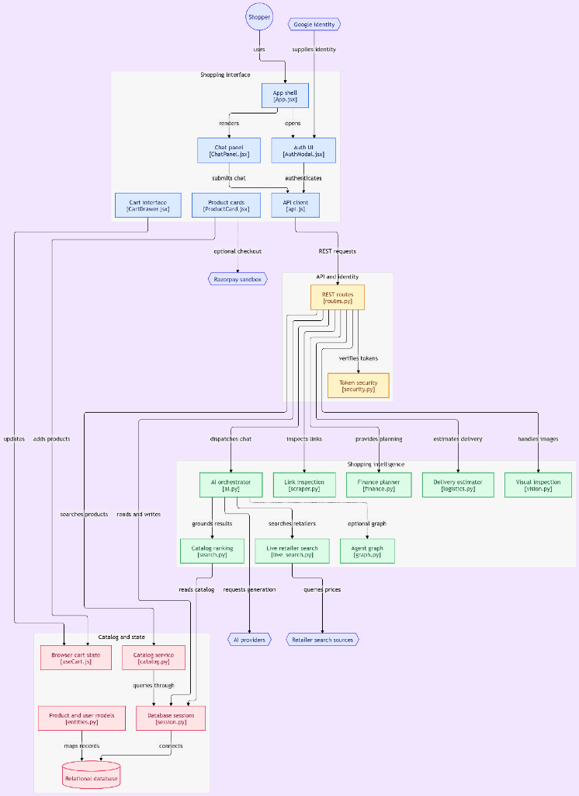
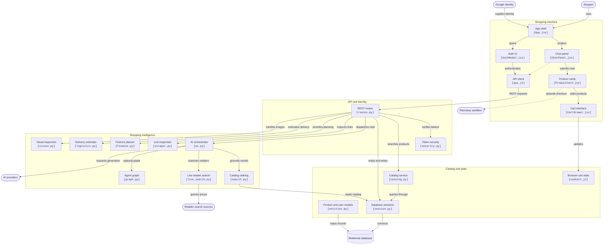

# ShopSense 🛍️

> **AI Shopping Copilot for India** — grounded catalog search, live retailer comparison, and cart-aware recommendations powered by Gemini / Groq / OpenAI.

[](shopsense-theta.vercel.app)
[](LICENSE)
[](https://www.python.org/)
[](https://fastapi.tiangolo.com/)
[](https://react.dev/)

---

## ✨ What It Does

ShopSense is a full-stack AI shopping assistant purpose-built for Indian e-commerce workflows:

| Feature | Details |
|---|---|
| **Fastshot Glassmorphic UI** | Full-viewport cinematic ambient stage with background video toggle, floating glass composer dock, and quick actions toolbar |
| **Multi-Agent Persona Switcher** | Dynamic runtime engine selection (`Sonnet 4.5` for deep comparisons, `Gemini Flash` for live web prices, `Deal Specialist` for logistics and visual inspection) |
| **Grounded catalog search** | Vector-like ranked search across 40+ curated products; budget + category filters applied before the LLM sees results |
| **Live web search** | Fetches real-time retailer pages (Amazon IN, Flipkart, Croma) and surfaces benchmark deal pricing snippets |
| **Comparison engine** | `"X vs Y"` queries pre-check and resolve both products independently, then hand a structured diff to the AI |
| **Financing & EMI Planner** | Month-by-month reducing-balance amortization schedules, No-Cost EMI eligibility check, and Razorpay IFSC validation |
| **Pincode Delivery Estimator** | Indian postal PIN validation with metro express vs regional delivery turnaround SLAs |
| **Cart-aware context** | Previous turns + cart contents are injected into every request so follow-ups work naturally |
| **Lamp login UI** | Interactive pull-cord desk-lamp animation; card reveals only when the cord is pulled |
| **Razorpay checkout** | Add to cart, review totals, and simulate Razorpay sandbox payments |

> **Cold-start notice:** The first request after the backend has been idle can take up to 60 s on the free Render tier. Please wait — do not refresh.

---

## 🏗️ Architecture



<details>
<summary>📐 View Interactive Mermaid Flowchart</summary>



</details>

---

## 🚀 Quick Start (Local)

### Prerequisites
- Docker & Docker Compose **or** Python 3.12 + Node 20 + Postgres 15
- A `GEMINI_API_KEY` (free at [Google AI Studio](https://aistudio.google.com)) **or** `OPENAI_API_KEY`

### With Docker Compose

```bash
git clone https://github.com/Sahiljain6/Shopsense.git
cd Shopsense

# 1. Copy and fill in secrets
cp backend/.env.example backend/.env
#    → Paste your GEMINI_API_KEY (and optionally OPENAI_API_KEY)

# 2. Build and run
docker-compose up --build

# 3. Open the app
open http://localhost:3000
```

### Without Docker

```bash
# Backend
cd backend
python -m venv .venv && source .venv/bin/activate   # Windows: .venv\Scripts\activate
pip install -r requirements.txt
cp .env.example .env   # edit with your API keys
alembic upgrade head
uvicorn app.main:app --reload --port 8000

# Frontend (new terminal)
cd frontend
npm install
npm run dev    # → http://localhost:5173
```

---

## ⚙️ Environment Variables

| Variable | Required | Default | Notes |
|---|---|---|---|
| `GEMINI_API_KEY` | ✅ recommended | — | Primary AI provider |
| `OPENAI_API_KEY` | optional | — | Fallback AI provider |
| `GROQ_API_KEY` | optional | — | Fast Llama-3 fallback |
| `DATABASE_URL` | ✅ | SQLite (dev) | `postgresql+psycopg://...` in prod |
| `JWT_SECRET` | ✅ | *(insecure default)* | Change before deploying |
| `CORS_ORIGINS` | ✅ | `http://localhost:3000` | Comma-separated allowed origins |
| `ENABLE_MULTI_AGENT` | optional | `false` | Set `true` to enable LangGraph pipeline |
| `RAZORPAY_KEY_ID` | optional | — | For Razorpay checkout |
| `RAZORPAY_KEY_SECRET` | optional | — | For Razorpay checkout |

---

## 🧪 Running Tests

```bash
cd backend
python -m pytest -v
# Expected: 31 passed
```

The test suite covers: catalog search regression, multi-agent fallback, history-aware Gemini calls, CORS restrictions, rate limiting, Alembic migration idempotency, and orphaned-revision self-healing.

---

## 📂 Project Structure

```
Shopsense/
├── backend/
│   ├── alembic/                 # Database migrations
│   ├── app/
│   │   ├── api/routes.py        # FastAPI routes (/auth, /chat, /cart, /wishlist)
│   │   ├── core/config.py       # Pydantic Settings
│   │   ├── db/session.py        # SQLAlchemy engine + session
│   │   ├── models/entities.py   # ORM models (User, Product, Review, …)
│   │   ├── services/
│   │   │   ├── ai.py            # AIOrchestrator — main inference + tool calling
│   │   │   ├── search.py        # Catalog search (SQL, vector-like ranking)
│   │   │   ├── live_search.py   # DuckDuckGo / Serper grounding
│   │   │   └── agents/          # LangGraph nodes + graph definition
│   │   └── main.py              # FastAPI app, CORS, rate limiting, startup seed
│   ├── tests/                   # 31 pytest tests
│   ├── entrypoint.sh            # Container start (alembic upgrade → uvicorn)
│   └── requirements.txt
├── frontend/
│   ├── src/
│   │   ├── components/
│   │   │   ├── AuthCard.jsx     # Lamp login page with pull-cord toggle
│   │   │   ├── ChatPanel.jsx    # Chat UI + retry logic for cold starts
│   │   │   ├── Hero.jsx         # Navbar + cart drawer
│   │   │   ├── Logo.jsx         # ShopSense brand mark component
│   │   │   └── ProductCard.jsx  # Expandable product card with Razorpay
│   │   ├── api.js               # API client with cold-start retry
│   │   └── index.css            # Dark-mode design system
│   └── index.html
├── docker/
│   └── backend.Dockerfile
├── docs/
│   └── screenshots/             # Drop real app screenshots here
├── render.yaml                  # Render deployment config
└── docker-compose.yml
```

---

## 🖼️ Screenshots

> Screenshots are in [`docs/screenshots/`](docs/screenshots/) — see [`SCREENSHOTS.md`](docs/screenshots/SCREENSHOTS.md) for the expected file names.

---

## 🛠️ Key Engineering Decisions

- **Single search pipeline**: All `/chat` requests flow through one ranked SQL catalog search with budget + category filters. There is no second "raw" pipeline that could return unrelated products.
- **Alembic self-healing**: `env.py` detects orphaned revision IDs in the `alembic_version` table and resets to the last known-good baseline before running `upgrade head`, preventing crash loops on stale deployments.
- **Conversation history in Gemini**: The Gemini provider path explicitly builds a `contents[]` array from `history` before appending the current turn, matching the OpenAI/HF paths.
- **Seed versioning**: `SEED_VERSION` integer in `main.py`; Postgres is only re-seeded when the deployed version exceeds the stored version, preventing silent data overwrites on restart.
- **Cold-start UX**: Frontend detects a failed first attempt and shows *"Waking up the server…"* before retrying — no hard error surfaced for a single timeout.

---

## 🤝 Contributing

Issues and PRs are welcome. For larger changes, please open an issue first.

---

## 📄 License

MIT © 2026 Sahil Jain
