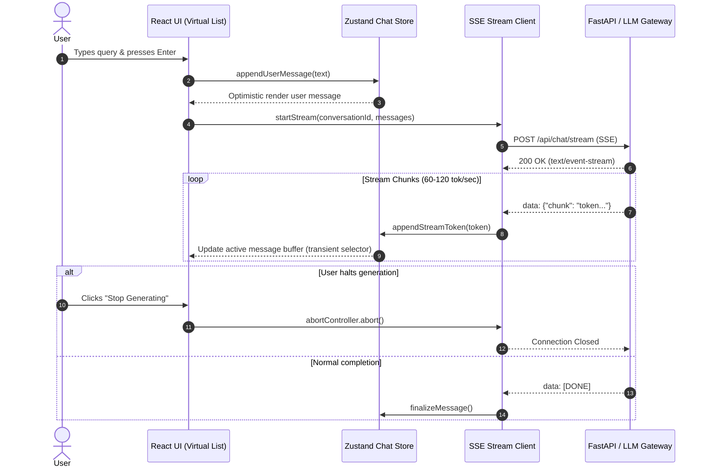

# Production AI Frontend Architecture & Stack Specification

## 1. Executive Summary & Evaluation Matrix

Building high-throughput, low-latency conversational AI applications requires solving three core architectural challenges:
1. **High-Frequency Token Streaming:** Handling 60–120+ tokens/second without blocking main-thread UI interactions or causing layout thrashing.
2. **Complex Conversation State:** Managing multi-turn dialogue, tool call state transitions, optimistic messaging, and abort/cancellation logic.
3. **Resilient Data Transport:** Real-time bi-directional or server-to-client streaming with automatic reconnects and backpressure handling.

### Framework Evaluation Matrix

| Framework | Ecosystem & AI SDKs | Concurrent Streaming Perf | State Management | Community Adoption for AI | Overall Fit |
| :--- | :--- | :--- | :--- | :--- | :--- |
| **React (Next.js / Vite)** | **First-Class (Vercel AI SDK, LangChain, OpenAI)** | **Excellent (Transitions, useDeferredValue)** | **Zustand, XState, TanStack Query** | **Dominant (>85%)** | **Recommended (9.8/10)** |
| **Svelte 5** | Moderate (Custom wrappers required) | Outstanding (Fine-grained Runes, no VDOM) | Built-in Runes / Svelte Stores | Niche (<8%) | Viable Alternative (8.2/10) |
| **Vue 3** | Moderate (Community adapters) | Good (Reactivity system) | Pinia | Secondary (<7%) | Viable Alternative (7.8/10) |

---

## 2. Recommended Frontend Stack

### A. Core Framework: React (Next.js 15+ App Router or Vite + React 19/18 + TypeScript)
- **TypeScript Support:** End-to-end typing for streaming chunk events, tool-calling payloads, and agent state schemas.
- **Concurrent React:** Enables background stream chunk buffering via `startTransition` and `useDeferredValue` so rapid token streams do not starve typing inputs or drag animations.
- **Turnkey Integration:** All major AI SDKs provide first-party React hooks (`useChat`, `useCompletion`, `useAssistant`).

### B. State Management: Zustand + TanStack Query
- **Zustand:**
  - Micro-store architecture with zero boilerplate.
  - Supports transient subscriptions (`useStore.subscribe`) for updating streaming text buffers without triggering component-tree-wide re-renders.
  - Native middleware for LocalStorage persistence and DevTools inspection.
- **TanStack Query (React Query):**
  - Manages asynchronous server state, model catalogue caching, user preferences, and optimistic chat mutations.
- **Optional (XState):**
  - For complex multi-agent workflows, human-in-the-loop approvals, and multi-step tool execution pipelines.

### C. HTTP Client & Transport: Fetch API + `@microsoft/fetch-event-source`
- **Native Web Streams (`fetch` + `ReadableStream`):** Zero-dependency native stream consumption with `AbortController` cancellation for immediate token-generation halting.
- **`@microsoft/fetch-event-source`:** Solves the browser `EventSource` limitation by supporting HTTP POST requests with request bodies (critical for sending chat history and system prompts), custom authorization headers, and resilient retry logic.

### D. Streaming Response Handler: Vercel AI SDK (`ai` & `@ai-sdk/react`)
- Seamless handling of Server-Sent Events (SSE).
- Built-in support for tool call streaming, structured JSON generation (`streamObject`), and multimodal inputs (images, audio).
- Handles protocol parsing, backpressure, and standard SSE event formatting.

### E. Real-Time UI Libraries
- **Component Primitives:** `shadcn/ui` (Radix UI headless primitives + Tailwind CSS). Accessible, headless, and easily customizable.
- **Virtualization:** `@tanstack/react-virtual` for virtualizing 1,000+ message chat histories to preserve 60 FPS scrolling during rapid generation.
- **Micro-Animations:** `framer-motion` for fluid message entrances, thinking shimmer effects, and tool execution status transitions.
- **Markdown & Code Rendering:** `react-markdown` with `remark-gfm` and syntax highlighting (`shiki` or `prism-react-renderer`).

---

## 3. Real-Time Streaming Data Flow Architecture

---

## 4. Performance Guidelines for Production LLM Streams

1. **Avoid Layout Thrashing:** Memoize message rows using `React.memo` and isolate streaming token updates strictly to the active message component.
2. **Debounce Auto-Scroll:** Anchor scroll position to the bottom only when the user is already at the bottom (`isAtBottom`); release lock if user scrolls up to review previous messages.
3. **Chunk Batching (RAF):** When processing extreme token velocity (>150 tokens/sec), batch chunk updates with `requestAnimationFrame` to match display refresh rates.
4. **Instant Cancellation:** Always pair every streaming request with an `AbortController` signal to avoid server cost leaks and stale state updates.
